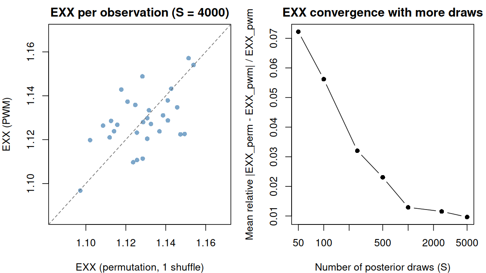
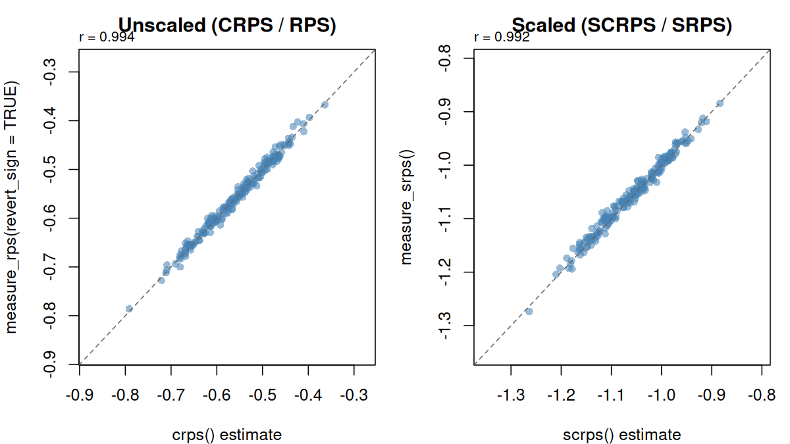
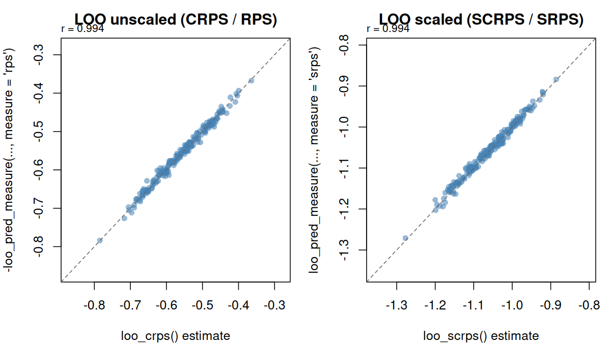
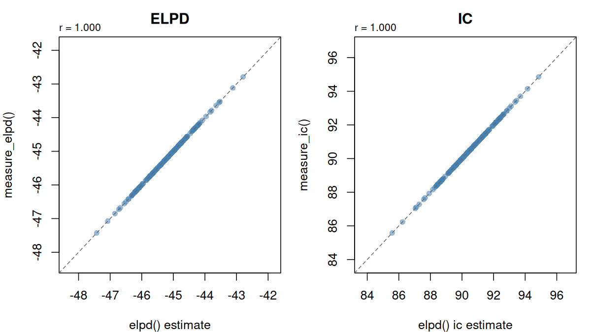

Developer Notes: `pred_measure` Feature
================

- [Status at a Glance](#status-at-a-glance)
- [Scope of this PR (`add-pred-measure` vs
  `loo-v3.0.0`)](#scope-of-this-pr-add-pred-measure-vs-loo-v300)
- [Design decisions (resolved)](#design-decisions-resolved)
- [Open decisions](#open-decisions)
- [Tasks](#tasks)
- [General questions](#general-questions)
- [References & resources](#references--resources)
- [Appendix: Numerical comparisons (deprecated vs new
  API)](#appendix-numerical-comparisons-deprecated-vs-new-api)

> **Status:** In Progress  
> **Base branch:** `loo-v3.0.0`  
> **Compare branch:** `pred_measure` (+ `integrate-loo_compare`)  
> **Related PR:** [\#363](https://github.com/stan-dev/loo/pull/363)  
> **Contributors:** @florence-bockting, @avehtari, @VisruthSK, @jgabry  
> **Last updated:** 2026-07-07

These notes document internal design decisions and ongoing work for the
`pred_measure` feature. This PR **adds** the new API on top of
`loo-v3.0.0`; it does not include other planned 3.0.0 changes
(e.g. broader `compare()` / `psislw()` removals) documented on the
`loo-v3.0.0` branch.

For the merge summary, see the PR description
([`internal-notes/pr-pred_measure.md`](../internal-notes/pr-pred_measure.md)).

------------------------------------------------------------------------

## Status at a Glance

| Area                          | Status                 |
|-------------------------------|------------------------|
| `pred_measure` API            | Done (initial release) |
| `measure_*()` built-ins       | Done                   |
| Scoring rules (`measure_rps`) | Done                   |
| Documentation                 | In progress            |
| `group_ids` grouping          | Not started            |
| `loo_compare` integration     | Done (`integrate-loo_compare`) |

------------------------------------------------------------------------

## Scope of this PR (`add-pred-measure` vs `loo-v3.0.0`)

### Added (did not exist on `loo-v3.0.0`)

- `R/pred_measure.R` — `insample_pred_measure()`, `loo_pred_measure()`,
  `kfold_pred_measure()`, `test_pred_measure()`, `pred_measure()`
- `R/pred_measure-compute.R`, `R/pred_measure-helpers.R`,
  `R/pred_measure-builtin.R` — orchestration and `measure_*()`
  implementations
- `supported_measures_list()`, `ptw_log_pred_density()`
- S3 print methods for `pred_measure`, `loo_pred_measure`,
  `kfold_pred_measure`
- `vignettes/migration-guide.Rmd`
- Website-only articles: `overview-measures.Rmd`,
  `pred-measure-workflow.Rmd`
- Test suite + pre-fitted fixtures + `test_data_generation.R`
- `loo_compare()` multi-measure path for `loo_pred_measure` objects
  (`integrate-loo_compare`)

### Changed on existing code (implementations retained)

- `elpd()`, `crps()`, `scrps()`, `loo_crps()`, `loo_scrps()`,
  `loo_predictive_metric()` — deprecated with migration docs; **same
  APIs and implementations** (e.g. `crps(x, x2, y)` permutation
  estimator unchanged)
- `elpd()` — refactored to `.elpd_matrix_impl()` to avoid double
  deprecation warnings
- Minor doc cross-references in `compare.R`, `psislw.R`
- `loo_compare()` — extended for `loo_pred_measure` objects: `rank_by`,
  multi-measure paired diffs, updated `print.compare.loo(measures = ...)`;
  classic `loo` path unchanged
- `R/loo-glossary.R` — multi-measure comparison columns (`{measure}_diff`,
  `rank_by`, etc.)
- `NEWS.md`, `NAMESPACE`, `_pkgdown.yml`, pkgdown CI workflow

------------------------------------------------------------------------

## Design decisions (resolved)

### D2: Scaled RPS — separate function vs. argument

**Decision:** Both. `measure_rps(..., scaled = TRUE)` is the
implementation; `measure_srps()` is a convenience wrapper. An explicit
`srps` built-in name is required so users can request both in one call:

``` r
pred_measure(y = y, ypred = ypred, measure = c("rps", "srps"), ...)
```

Without a separate `srps` name, duplicate measure names would require
custom functions.

### Unified scoring rule in the new API

`measure_rps()` subsumes CRPS, RPS, SCRPS, and SRPS for the **new**
workflow:

- Single `ypred` matrix (not two independent draw matrices)
- PWM/ECDF estimator (Aki’s implementation; verified against Seth’s
  derivations)
- Works for continuous and ordered categorical outcomes
- `measure_srps()` = scaled variant

Deprecated `crps()` / `scrps()` remain for backward compatibility with
the `x`, `x2` permutation-based API.

### ELPD and `ic` in the new API

Design choices **internal to `pred_measure`** (not a migration from
`loo-v3.0.0`, which has no `pred_measure`):

- When `ylp` is supplied, `elpd` is computed as the base summary
- `ic` is **not** included automatically; request via `measure = "ic"`
- `measure_elpd()` is separate from deprecated `elpd()` (different
  return type: `"measure"` vs `"elpd_generic"`)

### K-fold + categorical / multinomial models (brms)

- [x] Upstream fix for 3D `brms::kfold_predict()` output
  ([brms#1889](https://github.com/paul-buerkner/brms/issues/1889), fixed
  in [brms#1890](https://github.com/paul-buerkner/brms/pull/1890),
  merged to `main`)
- [x] Vignettes and pkgdown CI install brms from GitHub `master`
  (`vignettes/children/LOAD-BRMS-GITHUB.txt`,
  `.github/workflows/pkgdown.yaml`,
  `tests/testthat/data-for-tests/test_data_generation.R`)
- [ ] Drop GitHub brms pin once a CRAN release includes the \#1890 fix
- [ ] Verify `kfold_pred_measure()` with categorical/multinomial
  examples end-to-end (penguins fixture exists; confirm test/doc
  coverage)

### D4: `loo_compare()` for `loo_pred_measure` objects

**Decision:** Extend existing `loo_compare()`

- When all inputs are `loo_pred_measure` objects, compute paired
  differences for every measure common to all models
- Rank models by `rank_by` (default `"elpd"`); top-ranked model is the
  reference for all `{measure}_diff` columns
- ELPD-family measures keep `elpd_diff` / `se_diff`; other measures use
  `{measure}_diff` / `{measure}_se_diff`
- `p_worse` and `diag_diff` apply to ELPD only; `diag_elpd` per model as
  before
- Loss measures (MSE, RMSE, MAE, IC, Brier score, SRPS) compared on a common
  utility scale (higher is better): sign flipped from the raw loss orientation
  so worse models have negative diffs, consistent with ELPD. Orientation is
  read from `measure_revert_sign` on each `*_pred_measure()` result; result
  attribute
  `sign_converted_measures` records affected measures. A short message is
  emitted at compare time; full interpretation is in `?loo_compare` /
  `?loo-glossary`.
- Pointwise SEs use the same paired formula as ELPD when the overall
  estimate is a sum or mean of pointwise contributions; otherwise
  `{measure}_se_diff` is `NA` (e.g. `r2`, `mse`, `rmse`)
- Reuse `elpd_diffs`, `se_elpd_diff`, `diag_diff`, `diag_elpd`, and
  many-model order-statistic check (with `rank_by` when applicable)
- `print.compare.loo(measures = ...)` shows one or all measure diff tables

Implemented on branch `integrate-loo_compare`; tests in `test_compare.R`
with fixture `test_data_roaches_compare.Rds`.

------------------------------------------------------------------------

## Open decisions

### D1: Sign convention for pointwise estimates

- **Context:** Measures differ in orientation (e.g. ELPD/CRPS on a utility
  scale; MSE and Brier score as losses). `loo_compare()` aligns them for
  paired differences.
- **Decision (for `loo_compare`):** Each `*_pred_measure()` result stores the
  `revert_sign` value used per measure in `measure_revert_sign`. Built-in loss
  measures are sign-flipped for utility-scale `{measure}_diff` when
  `revert_sign` is `FALSE`.
- **Still open:** Whether to expose orientation metadata on `*_pred_measure()`
  results themselves (e.g. when `revert_sign = TRUE` in `control`).

### D3: Handling of `r_eff`

- **Context:**
  [stan-dev/posterior#446](https://github.com/stan-dev/posterior/issues/446)
- **Question:** How should `r_eff` be handled in `pred_measure`
  workflows?
- **Decision:** *pending*

------------------------------------------------------------------------

## Tasks

### Refactoring (within new API)

- [x] Add `measure_elpd()` for the new API
- [x] Refactor deprecated `elpd()` to `.elpd_matrix_impl()` (no double
  warnings)
- [x] Add `measure_rps()` as unified scoring-rule implementation (single
  `ypred`)
- [x] Keep deprecated `crps()` / `scrps()` with `x`, `x2` API unchanged
- [x] In `*_pred_measure()`, compute `elpd` as base when `ylp` supplied;
  require explicit `measure = "ic"` for information criterion
- [x] Document and test deprecated vs new API comparisons *(see
  appendix)*
- [x] Provide an interface to `loo_compare` and verify consistency
- [ ] Resolve `r_eff` handling *(see D3)*

### Implementation

- [x] Consolidate CRPS/RPS/SCRPS/SRPS in `measure_rps()` for new API
- [x] Resolve `srps` naming *(see D2)*
- [x] brms k-fold categorical support unblocked upstream *(see above)*
- [ ] Drop GitHub brms pin after CRAN release

### Documentation

- [x] Migration guide (`vignettes/migration-guide.Rmd`)
- [x] Overview of measures (`overview-measures.Rmd`)
- [x] Workflow article (`pred-measure-workflow.Rmd`)
- [x] Online-only articles published via `_pkgdown.yml`
- [ ] Formula derivations article (`pred_measure-formulas.Rmd`)
- [ ] Detailed per-measure descriptions (derivations where appropriate)
- [x] Extend glossary (`R/loo-glossary.R`) — multi-measure `loo_compare` columns
- [ ] Extend glossary further — measure, metric, score, utility, loss
  (general terms)

### Grouping via `group_ids`

- [ ] Work out grouping scenarios for LOO and k-fold

- [ ] Implement in `kfold_pred_measure()`, `loo_pred_measure()`,
  `pred_measure()`

  > **Blocker:** Implementation approach uncertain; grouping scenarios
  > must be understood before coding begins.

------------------------------------------------------------------------

## General questions

- Rename `ic` → `information_criteria` for clarity?
- Should `measure_elpd()` also return `ic`, or keep them separate?
- What defines class `"loo"` on measure objects? `loo_pred_measure` inherits
  `"loo"` (see `integrate-loo_compare`); deprecated `elpd_generic` also
  inherits `"loo"`.
- Should `elpd` always be computed when `ylp` is supplied, or allow
  `loo_pred_measure()` for non-ELPD measures only?

------------------------------------------------------------------------

## References & resources

| Resource                    | Link / contact                                                                                                               |
|-----------------------------|------------------------------------------------------------------------------------------------------------------------------|
| Cross-validation FAQ        | <https://users.aalto.fi/~ave/CV-FAQ.html>                                                                                    |
| `r_eff` in posterior (Aki)  | <https://github.com/stan-dev/posterior/issues/446>                                                                           |
| brms k-fold 3D fix          | [brms#1889](https://github.com/paul-buerkner/brms/issues/1889), [brms#1890](https://github.com/paul-buerkner/brms/pull/1890) |
| `rps` derivation (Seth)     | @florence-bockting, @avehtari                                                                                                |
| `rps` implementation (Aki)  | @florence-bockting, @avehtari                                                                                                |
| K-fold vignette             | <https://mc-stan.org/loo/articles/loo2-elpd.html>                                                                            |
| Broader loo 3.0.0 migration | `loo-v3.0.0` branch, `dev/migration-guide-loo-v3.Rmd`                                                                        |

------------------------------------------------------------------------

## Appendix: Numerical comparisons (deprecated vs new API)

Simulations and tests that validate design choices in this PR. Automated
comparisons live in `tests/testthat/test_crps.R` (CRPS/RPS section).

### CRPS / RPS

Deprecated `crps()` / `scrps()` and new `measure_rps()` /
`measure_srps()` target the same scoring rules but use different
estimators.

#### API mapping

| Deprecated        | New workflow                                    | Notes                               |
|-------------------|-------------------------------------------------|-------------------------------------|
| `crps(x, x2, y)`  | `measure_rps(y, ypred = x, revert_sign = TRUE)` | Sign flip on unscaled score         |
| `scrps(x, x2, y)` | `measure_srps(y, ypred = x)`                    | Same sign convention                |
| `loo_crps(...)`   | `loo_pred_measure(..., measure = "rps")`        | Additional LOO weighting difference |
| `loo_scrps(...)`  | `loo_pred_measure(..., measure = "srps")`       | Additional LOO weighting difference |

#### Sources of numerical difference

1.  **Sign convention (unscaled only).** `crps()` returns
    `0.5·EXX − EXy` (utility: higher is better). Default `measure_rps()`
    negates this; use `revert_sign = TRUE` to match `crps()`. Scaled
    scores (`scrps` / `measure_srps`) already share the formula
    `−EXy/EXX − 0.5·log(EXX)`.

2.  **EXX estimator (in-sample).** Both estimate `E|X − X'|`, but:

    - **Deprecated:** two draw matrices `x`, `x2`; one random shuffle
      per permutation (`EXX_compute()` in `R/crps.R`).
    - **New:** single `ypred` matrix; PWM on sorted draws (Zamo &
      Naveau, 2018).

    `EXy = E|X − y|` is **identical** between APIs. After sign
    alignment, all pointwise differences come from EXX.

3.  **LOO weighting.** `loo_crps()` shuffles a second draw matrix and
    applies joint PSIS weights to `|x − x2|`.
    `loo_pred_measure(..., measure = "rps")` uses weighted PWM on a
    single `ypred` with PSIS weights from `ylp` only — so LOO
    differences combine EXX method and importance-weighting approach.

#### Key results (reference simulation)

<figure>

<figcaption aria-hidden="true">CRPS/RPS comparison: PWM vs permutation
EXX estimators</figcaption>
</figure>

*Figure: left — per-observation EXX estimates at the brms default draw
count (S = 4000 post-warmup draws: 4 chains × 1000); right — mean
relative EXX error decreases with more posterior draws.*

| Metric (S = 100, n = 30)                   |  Value |
|:-------------------------------------------|-------:|
| Mean rel. \|EXX_perm - EXX_pwm\| / EXX_pwm | 0.0688 |
| cor(pointwise CRPS, sign-aligned)          | 0.9923 |
| Mean \|pointwise CRPS diff\|               | 0.0339 |
| cor(pointwise SCRPS, SRPS)                 | 0.9911 |

#### In-sample outcome comparison

<figure>

<figcaption aria-hidden="true">CRPS/RPS outcome comparison across
replications</figcaption>
</figure>

*Figure: 200 simulations (S = 100, n = 30). Left — `crps()` vs
`measure_rps(revert_sign = TRUE)`; right — `scrps()` vs
`measure_srps()`.*

#### LOO outcome comparison

<figure>

<figcaption aria-hidden="true">LOO CRPS/RPS outcome comparison across
replications</figcaption>
</figure>

*Figure: 200 LOO simulations (S = 100, n = 30). Left — `loo_crps()` vs
sign-aligned `loo_pred_measure(..., measure = "rps")`; right —
`loo_scrps()` vs `loo_pred_measure(..., measure = "srps")`.*

**CRPS/RPS takeaway:** Results are highly correlated but not
interchangeable. The PWM estimator is lower-variance and requires only
one draw matrix. For migration, compare trends and rankings rather than
expecting pointwise equality.

### ELPD / IC

Deprecated `elpd()` and new `measure_elpd()` / `measure_ic()` compute
the same in-sample pointwise log predictive density and information
criterion from a log-likelihood matrix. The difference is return
structure (`elpd_generic` with both columns vs separate `"measure"`
objects), not the underlying formula.

| Deprecated                      | New workflow        | Notes                             |
|---------------------------------|---------------------|-----------------------------------|
| `elpd(ylp)$estimates["elpd", ]` | `measure_elpd(ylp)` | Same `lppd_i` computation         |
| `elpd(ylp)$estimates["ic", ]`   | `measure_ic(ylp)`   | `ic_i = -2 * lppd_i` in both APIs |

#### Outcome comparison

<figure>

<figcaption aria-hidden="true">ELPD / IC outcome comparison across
replications</figcaption>
</figure>

*Figure: 200 simulations (S = 100, n = 30). Left — `elpd()` vs
`measure_elpd()`; right — `ic` from `elpd()` vs `measure_ic()`.*

**ELPD/IC takeaway:** In-sample estimates match between deprecated and
new APIs. Migration is about return type and `*_pred_measure()` workflow
integration, not numerical differences.
